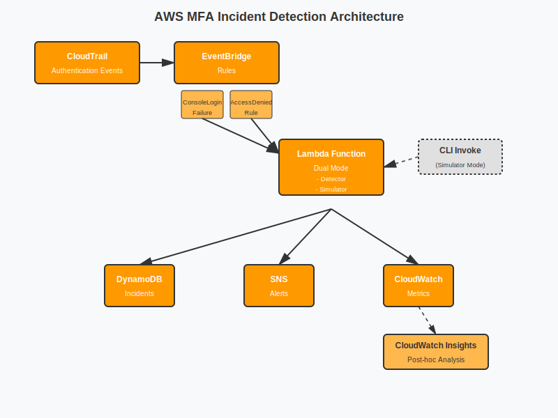

# AWS MFA Incident Response Simulator

Dual-mode incident detection system for MFA authentication failures: supports both **live detection** from CloudTrail events and **simulation mode** for testing and demos.

This system detects and classifies MFA-related authentication failures in AWS by correlating CloudTrail signals in real time and during controlled simulation, enabling investigation without automated identity mutation.

## Operating Modes

| Mode | Trigger | Use Case |
|------|---------|----------|
| **Detector** | Real CloudTrail events via EventBridge | Production monitoring |
| **Simulator** | Manual CLI invoke with test payload | Demos, testing, development |

The Lambda automatically detects which mode based on the event structure.

[](https://aws.amazon.com/)


---

## What This Does

Simulates **3 real-world MFA failure scenarios** with:

| Component | Purpose |
|-----------|---------|
| **Incident Simulator** | Lambda function that generates realistic authentication failures |
| **Real-time Detection** | EventBridge rules catching CloudTrail events as they occur |
| **Post-hoc Analysis** | CloudWatch Insights queries for investigation |
| **Alerting Pipeline** | SNS notifications on incident detection |
| **Incident Tracking** | Automated status updates and alerting for response teams |
| **Incident Runbooks** | Step-by-step resolution documentation with console evidence |

---

## Automation Boundaries (Intentional Non-Actions)

This system does **not**:
- Reset MFA devices
- Disable IAM users
- Modify policies automatically

Reason:
MFA failures often reflect user-side or policy-evaluation issues where automated remediation risks account lockout or privilege regression. This system prioritizes detection, classification, and evidence preservation over action.

---

## Signal Ambiguity & False Positives

AWS does not emit explicit "token expired" errors for MFA failures. Detection relies on:
- Temporal correlation
- Prior successful MFA events
- Absence of credential compromise indicators

As a result, findings are classified as "consistent with" causes, not asserted as root cause without admin review.

---

## Incident Scenarios

### 1. MFA Authentication Failure (Consistent with Token Expiration)

**What happens:** User attempts console login, MFA validation fails due to timing issues or expired TOTP token.

**Detection signal:**
- `ConsoleLogin` event with `additionalEventData.MFAUsed = "No"`
- `errorMessage = "Failed authentication"`
- Optional: Prior successful MFA login within short window

**Response:** User must re-authenticate. No automated remediation (user action required).

---

### 2. Rate Limiting / Account Lockout

**What happens:** Multiple failed MFA attempts trigger rate limiting or temporary lockout.

**Detection signal:**
- 5+ `ConsoleLogin` failures within 60-second window
- Same `userIdentity.userName`
- Same `sourceIPAddress`

**Response:** Automated incident tracking—status updated in DynamoDB after cooldown, SNS alert sent, event logged for investigation. *Tracks and alerts; does not modify IAM directly.*

---

### 3. Policy Mismatch (MFA Present but Action Denied)

**What happens:** User has valid MFA session but IAM policy denies action due to misconfigured conditions.

**Detection signal:**
- `errorCode = "AccessDenied"`
- Condition evaluated against `aws:MultiFactorAuthPresent`
- Action attempted visible in `requestParameters`

**Response:** Admin intervention required. Runbook guides policy review.

---

## Architecture



```
┌─────────────────────────────────────────────────────────────────────┐
│                         Detection Pipeline                          │
├─────────────────────────────────────────────────────────────────────┤
│                                                                     │
│   ┌─────────────┐                                                   │
│   │ DETECTOR    │  CloudTrail ──▶ EventBridge ──┐                   │
│   │ MODE        │  (Real events)  (Rules)       │                   │
│   └─────────────┘                               │                   │
│                                                 ▼                   │
│   ┌─────────────┐                           Lambda ──▶ DynamoDB    │
│   │ SIMULATOR   │  CLI Invoke ─────────────▶ (Dual    (Incidents)  │
│   │ MODE        │  (Test payload)             Mode)        │        │
│   └─────────────┘                               │          │        │
│                                                 ▼          ▼        │
│                                               SNS ◀── CloudWatch    │
│                                            (Alerts)   (Dashboard)   │
│                                                                     │
├─────────────────────────────────────────────────────────────────────┤
│                       Analysis Layer                                │
├─────────────────────────────────────────────────────────────────────┤
│                                                                     │
│   CloudWatch Insights ──────▶ Post-hoc queries for investigation   │
│   Dashboard ────────────────▶ Situational awareness (4 widgets)    │
│                                                                     │
└─────────────────────────────────────────────────────────────────────┘
```

**Dual-mode detection:**
- **Detector Mode**: Processes real CloudTrail JSON from EventBridge
- **Simulator Mode**: Accepts test payloads for demos and development

**Design separation:**
- **EventBridge** = Real-time detection
- **CloudWatch Insights** = Post-hoc analysis / investigation  
- **Dashboard** = Situational awareness

---

## Dashboard Widgets

| Widget | Purpose |
|--------|---------|
| Incident count by type (24h) | Volume awareness |
| Failed ConsoleLogin over time | Trend detection |
| Simulated resolution time | Workflow efficiency |
| Active incidents | Current state |

---

## Quick Start

### Prerequisites
- AWS CLI configured with appropriate permissions
- Terraform >= 1.0
- Python 3.9+

### Deploy

```bash
cd terraform
terraform init
terraform plan
terraform apply
```

### Trigger Test Incident

```bash
# Invoke simulator Lambda
aws lambda invoke \
  --function-name mfa-incident-simulator \
  --payload '{"scenario": "rate_limiting", "user": "test-user"}' \
  response.json
```

---

## Cost Estimate

This project is designed to run within AWS Free Tier limits for development and demonstration purposes.

| Resource | Configuration | Estimated Monthly Cost |
|----------|---------------|----------------------|
| Lambda | 2 functions, ~1000 invocations | $0.00 (Free Tier: 1M requests) |
| DynamoDB | On-demand, <1GB storage | $0.25 |
| CloudWatch | Logs, metrics, 1 dashboard | $0.50 |
| SNS | <1000 notifications | $0.00 (Free Tier: 1M publishes) |
| EventBridge | <1M events | $0.00 (Free Tier) |
| **Total** | | **< $1.00/month** |

*Costs may vary with usage. Estimates based on US-East-1 pricing as of December 2025.*

---

## Project Structure

```
aws-mfa-incident-simulator/
├── README.md
│
├── lambda/
│   ├── simulator/              # Incident generation
│   │   ├── handler.py
│   │   └── requirements.txt
│   └── responder/              # Assisted remediation
│       ├── handler.py
│       └── requirements.txt
│
├── terraform/
│   ├── main.tf                 # Provider, backend
│   ├── lambda.tf               # Lambda functions
│   ├── eventbridge.tf          # Detection rules
│   ├── cloudwatch.tf           # Insights, alarms
│   ├── dashboard.tf            # 4-widget dashboard
│   ├── dynamodb.tf             # Incident storage
│   ├── sns.tf                  # Alert notifications
│   ├── variables.tf
│   └── outputs.tf
│
├── incidents/
│   ├── incident-01-mfa-auth-failure.md
│   ├── incident-02-rate-limiting.md
│   └── incident-03-policy-mismatch.md
│
├── queries/
│   ├── mfa-auth-failure.sql
│   ├── rate-limiting.sql
│   └── policy-mismatch.sql
│
├── screenshots/
│   └── (console evidence captured during incidents)
│
└── LICENSE
```

---

## Planned Extensions

- **Impossible Travel Detection:** Geolocation anomaly based on source IP
- **Device Compliance:** Virtual MFA vs hardware key validation

---

## What I Learned

- **Operational thinking:** Detection, diagnosis, and resolution—not just building
- **Signal precision:** AWS doesn't emit "token expired" explicitly; you detect patterns
- **Scope discipline:** 3 clean scenarios > 5 half-baked ones
- **Interview framing:** Language matters—"consistent with" vs "caused by"

---

## Author

**Mohammad Khan**  
IT Operations Specialist | AWS Solutions Architect Associate  
University of Houston

[LinkedIn](https://linkedin.com/in/mohammad-jkhan/) · [GitHub](https://github.com/Mjkhan9)

---

## License

MIT License - Created for educational and portfolio purposes.
